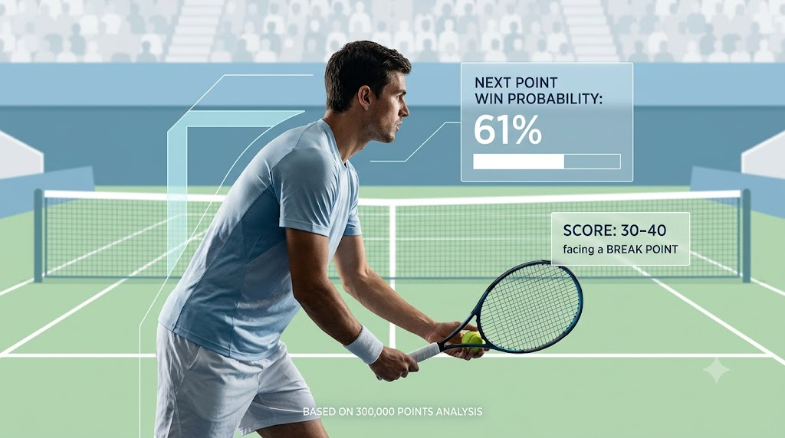

A few weeks ago, my batchmates at ISB and I took on a tennis analytics challenge with a strict constraint.

We were given over 300,000 point-by-point entries across 1,800 professional matches, covering serves, scores, and outcomes. But the coaching team made one thing clear: they didn't want another retroactive dashboard describing what had already happened. They wanted something usable mid-match, something that could inform real-time decisions.

That changed everything. Data came second; the first job was agreeing on the exact decision we were trying to inform.

## Defining the core objective

Before writing a line of code, we spent hours arguing over one question: What should the model actually predict?

We eventually settled on a strict definition: the probability that the server wins the next point, using only information available before the point starts.

That one boundary did a lot of work for us. It gave us a clean benchmark for evaluating probability shifts, and it ruled out an entire category of variables before we'd even opened the dataset properly.

## The approach and validation strategy

We split the work into three phases: data exploration, feature engineering, and modeling.

Early on, validation became our biggest hurdle, because tennis points aren't independent events: what happens in game one can shape what happens in game ten.

Randomly splitting points into train and test sets would have been a disaster. If points from the same match ended up on both sides, the model would memorize match-specific patterns and hand us inflated accuracy numbers. So we built our validation split strictly around entire, intact matches.

## Clean data, hidden leakages

Exploratory analysis undercut a few assumptions we'd walked in with. Because the data spanned multiple years, logging consistency varied a lot: detailed shot-level fields existed for some seasons and simply didn't exist for others. Relying on those richer fields would have meant building a model that quietly failed on historical or patchy data, so we had to be selective about what we trusted.

Then came the scoreboard leakages.

Some fields reflected match state after a point had been played, not before. Used directly, the model would have effectively seen the outcome before predicting it. We only caught this by manually tracing matches point by point. Shifting the state variables back by one point fixed it. It was a simple bug, but one that's easy to miss when you're looking at summary tables instead of individual rows.

## Model choice: interpretability over pure accuracy

We chose logistic regression as our primary model. Gradient-boosted trees edged it out on accuracy, by a couple of percentage points, but cost us explainability, and our end user was a coaching team, not a data science panel. Clear, intuitive coefficients mattered more to them than a marginal accuracy gain from a black box.

The final feature set focused strictly on pre-point context:

- Score entering the point and game/set differentials
- Facing a break point (yes/no)
- Serving performance within that specific match up to that point

That serving-performance feature turned out to be our strongest predictor by a wide margin.

We also tossed out some tempting raw metrics, like rally length, shot type, and serve speed. They happen during the point, so using them to predict how a point starts is textbook data leakage.

## Challenging conventional wisdom

A couple of results genuinely surprised us. Take break points: raw data shows servers win fewer points when facing one. Logical, right? But once we controlled for the score context, that isolated break-point penalty largely vanished. The score itself was doing the heavy lifting. The server was simply behind in the game.

Momentum held a similar surprise, from a different angle. Winning a point did slightly raise the odds of winning the next one, but that effect shrank a lot once we accounted for player quality. Good players simply win points in bunches because they're good; what looked like momentum was mostly just skill.

The real standout was in-match serve performance: how well a player had served earlier in that specific match, updated live. It outweighed almost every static score-based feature we tried.

## Translating outputs for the coaching team

Statistical significance means nothing if a coach can't use it courtside. Showing someone a regression coefficient isn't going to change what they do mid-match.

So we framed the deliverables around what a coach would actually need. Instead of flagging single scorelines, we mapped how win probability shifts continuously across a game, so there's no artificial cutoff where a recommendation suddenly flips. We reported the shifts in plain terms, for instance the exact change in win probability moving from 30-30 to 30-40, rather than burying them in p-values. And we were upfront about the limits: the model held up well on matches and players it hadn't seen, but accuracy dropped a bit against completely unfamiliar opponents, and we said so rather than glossing over it. Same with momentum: winning a point is correlated with winning the next one, but that's not the same as saying it causes it, and we made sure that distinction didn't get lost in translation.

Building the model was only half the job. Defining the right question, catching the leakage, and translating the findings for people who don't read regression output took up the rest.

Big thanks to my ISB teammates for all the whiteboarding sessions, debates, and late nights. There were plenty of moments where the data forced us to stop and rethink what we thought we knew about tennis.

And yes, analyzing 300,000 points does make watching the next match a lot more interesting.
