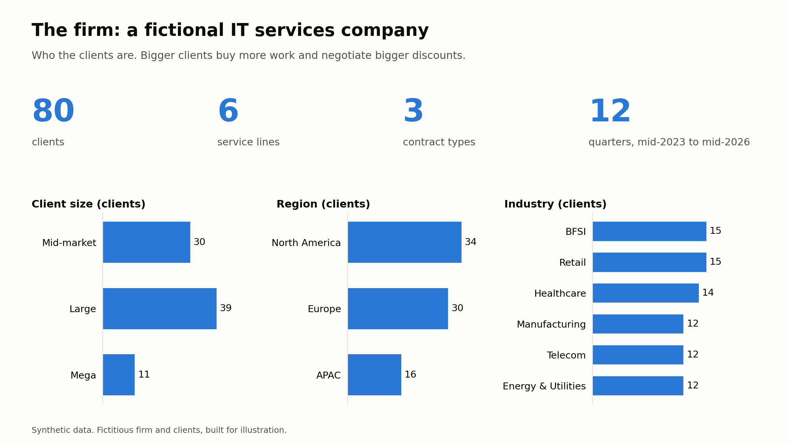
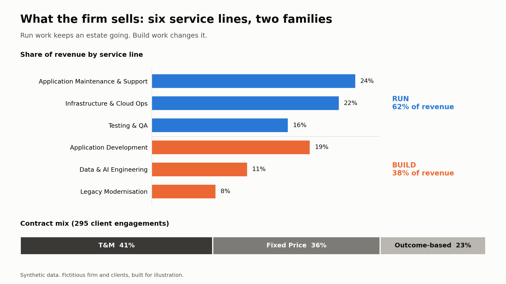
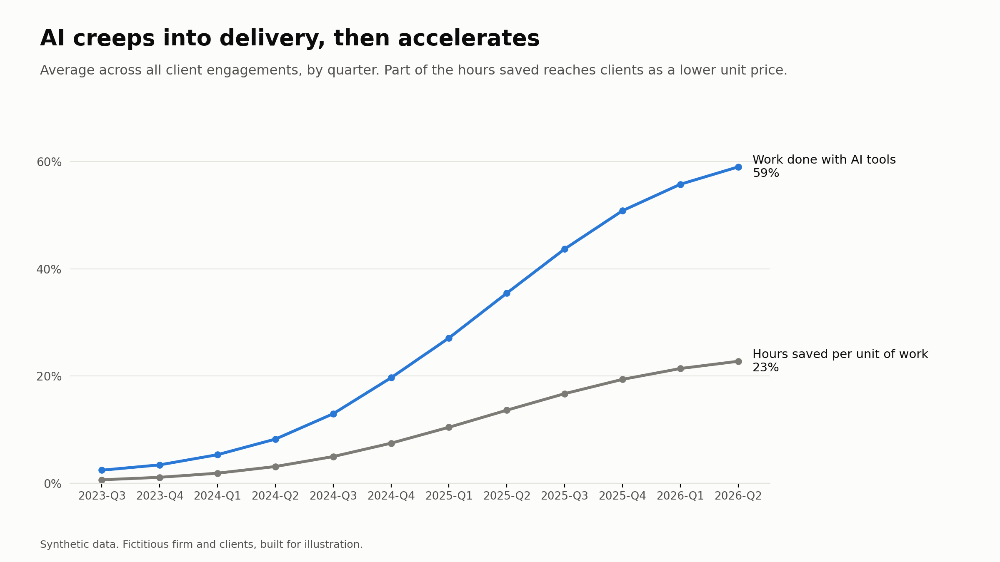
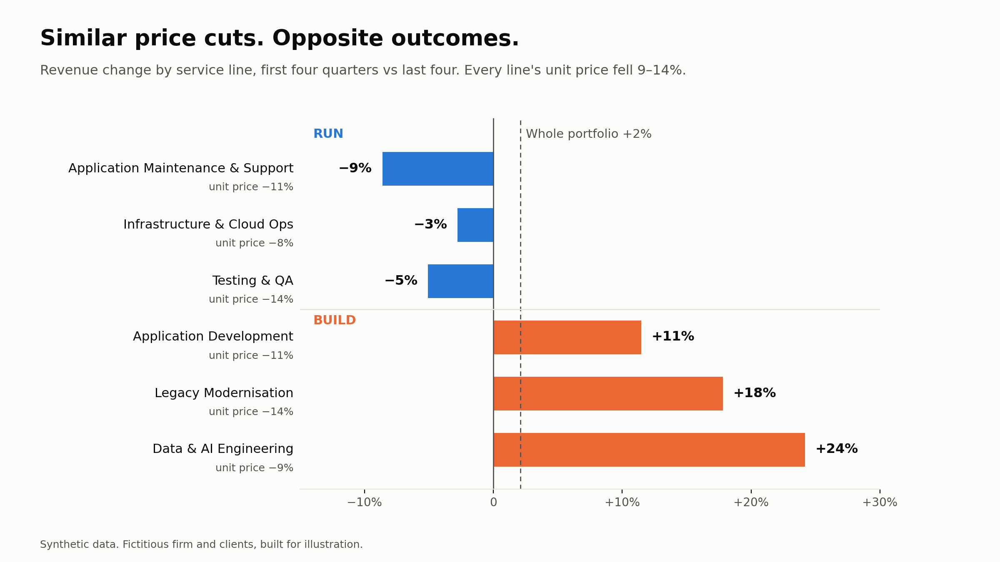
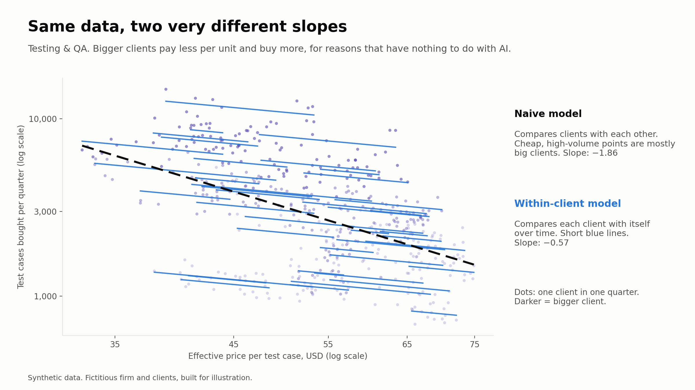
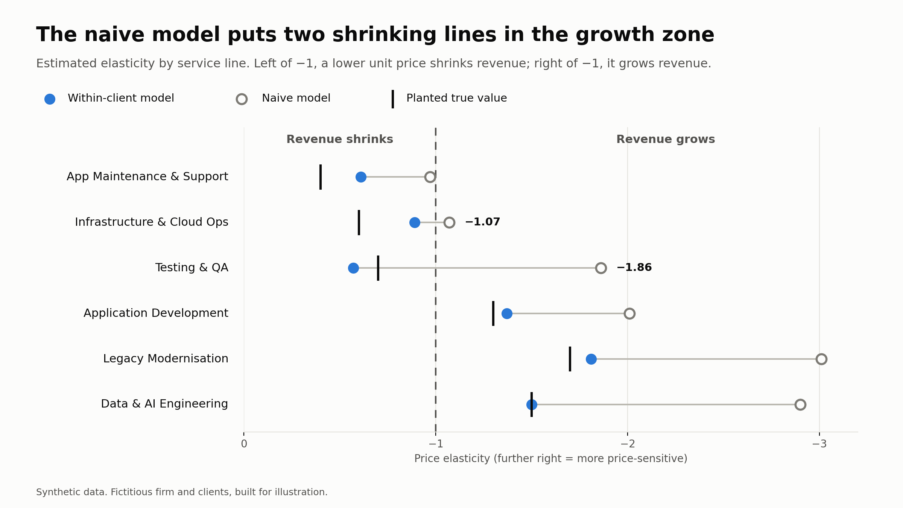
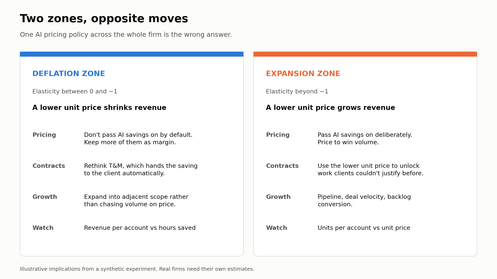

> **Disclaimer:** This is an experiment. I built the dataset myself with a script and made a few assumptions. All data in the experiment (company, clients, revenues and so on) is fictitious. What I'm sharing is a *method:* how to tell whether AI will grow or shrink your revenue, and how easy it is to get that answer wrong.

This is the first article in a series on AI, Pricing and the Economics of IT Services.

## Everyone's talking about AI deflation. Few are measuring it.

If we scan recent press releases and analyst reports from IT service providers, we can't miss a statement about the impact of AI on revenue. Below is a summary of some of the recent articles:

- AI-led deflation in traditional services could run at 2–3% a year. A deal once worth \$100 million may now be worth about \$80 million.

- One of the largest Indian IT firms reported its first annual revenue decline (in constant currency) since listing in 2006.

- Clients are asking for the same work at 25–30% less, and delivered faster.

AI deflation. Same work. Fewer hours. Smaller bill. Yet one of the industry's top executives framed it differently:

> "How fast and how much more we are able to go ahead of the (revenue) deflation will determine the growth going forward."

But there is one thing worth noting in all these statements. While the price cut is visible everywhere, we can't yet see how much new demand these lower prices are creating.

Most of the debate asks *whether* AI will shrink IT services revenue. I would, in fact, ask this differently –

> **“When the price of a unit of work falls, how much more of it do clients buy?”**

Economists call this the *price elasticity of demand*. On Bloomberg's Odd Lots podcast in April, economist Alex Imas called it the critical unknown, the variable that decides whether AI brings a hiring boom or mass layoffs in fields like software engineering.

## So, what is elasticity?

What does it actually measure?

Elasticity answers one question – when the price moves, how much does the volume move?

**Elasticity = % change in volume ÷ % change in price**

If we cut the price by 10% and volume goes up by 20%, elasticity is −2. Why is it negative? Price and volume are moving in the opposite directions.

What does this mean for IT Services? We don’t sell units per se. We sell T&M hours or a fixed-price scope. But beneath every contract, the client is buying a unit of work: a resolved ticket, a story point, or a migrated function.

- Volume is how much of that work the client buys.

- Price is what the client effectively pays for one unit of it. Under T&M, that's the rate times the hours a ticket takes. Under fixed price, it's the contract value spread over the work delivered.

I first met this concept in my pricing class at ISB, and I lost my way once the log-log regression outputs came in. So I wanted to see what measuring it would actually take, in a business I know. I built a small synthetic services firm, ran the numbers, and watched where the obvious approach breaks.

## The one rule that decides it

Revenue is price × volume. So when AI cuts the price of a unit of work, everything depends on how far volume moves in response.

- **If elasticity sits between 0 and −1**, volume rises, but by less than the price fell. A cheaper unit of work means **less revenue**. The ticket gets 30% cheaper, the client raises 20% more tickets, and the bill still shrinks.

- **If elasticity goes beyond −1**, volume rises faster than the reduction in price. A cheaper unit of work means **more revenue**. The function point gets 30% cheaper, the client migrates 70% more of them, and the bill grows.

Economists call the second case the Jevons paradox: make something cheaper to produce, and people use so much more of it that total spending goes up.

So the question for any services firm is simple to ask and hard to answer: **which side of −1 does our work sit on?**

## What I built, and why the data is synthetic

Real firms don't publish client-level price and volume data. And even if one did, we'd never know the true elasticity to check our answer against.

So I built a firm where I *do* know the answer.

**The firm.** A fictional IT services company with 80 clients across industries and regions, from mid-market accounts to very large ones. It sells six service lines in two families:

- **Run:** application maintenance, testing, infrastructure and cloud operations

- **Build:** application development, legacy modernisation, data and AI engineering

**The story.** Over three years, quarter by quarter, AI creeps into delivery. It cuts the hours each unit of work takes. Part of that saving reaches the client as a lower unit price: quickly on T&M, slowly on fixed price. Clients respond by buying more work, or not.

**The answer I planted.** I set the run lines as inelastic, on the logic that an estate only needs so much running. I set the build lines as elastic, on the logic that clients carry backlogs they couldn't afford before. To be clear, this is my hypothesis, not a finding. The experiment doesn't test whether the split exists. It tests whether you can *detect* it.

**The mess, added on purpose.** Real demand moves for many reasons besides price. So in my fictional firm, big clients negotiate bigger discounts *and* buy more work. Budgets rise and dip. Some markets grow regardless. Seasons matter.

That last part is what trips up the obvious analysis. We'll get there.

## What happened to the firm

Start with the view most leadership teams see first: the total.

Over the three years, portfolio revenue ended up about **2% higher**. AI arrived, prices fell, and the firm held its ground. Most reviews would stop there.

Now split it by service line.

Every line saw its unit price fall by roughly the same amount, 9–14%. But the run lines lost revenue, and the build lines gained it. Same AI, same kind of price cut, opposite results.

And look where the losses sit. The run lines carry about 62% of the firm's revenue. The build lines are growing fast just to keep the total flat. So the flat total is really two opposite trends cancelling each other out, at least for now.

**Takeaway:** never judge AI's impact on revenue from the total. The average hides the split.

**But don't read elasticity off this chart.** A before-and-after comparison mixes the effect of price with everything else that moved over the same three years: client budgets, markets that were growing anyway, the mix of clients. Some of that build growth would have happened without any price cut. To isolate the effect of price, you need a model.

## The trap: the obvious model gets it wrong

The obvious way to measure elasticity is to take every client, every quarter, plot price against volume, and draw the best-fit line. Its slope is your elasticity. It is quick, and easy to defend in a SteerCo review.

Here's what that looks like for one service line, Testing & QA.

The black dashed line is the obvious model. Its slope is **−1.86**. Read at face value, it says testing demand is highly elastic, so passing on AI savings would grow testing revenue.

But look at who sits where. The dark dots, low-price and high-volume, are mostly the biggest clients. They pay less per test case because they negotiate bigger discounts. They buy more because they're big. Neither has anything to do with AI or with price sensitivity. The obvious model sees "lower price, more volume" and gives price the credit for what is really scale. It is a mirage (see my earlier article, "[The Hidden Trap of Dimension Changes](/concepts/the-architecture-of-deception)").

**The fix is to compare each client with itself, over time.** When *this* client's price fell, how much more did *this* client buy? Those are the short blue lines. Statisticians call it a fixed-effects model. I also controlled for the things that move demand regardless of price: budgets, market trends and seasons.

The within-client slope for testing is **−0.57**, the inelastic side of −1. The value I planted was −0.7.

Now run the same comparison across all six lines.

The naive model overstates price sensitivity in every single line, by 1.5 to 2.7 times. For the build lines, that's an exaggeration but still the right direction. For the run lines, it's worse than an exaggeration. Testing and infrastructure land in the growth zone, and maintenance sits right on the boundary.

The within-client model puts all six lines on the right side of −1. It isn't perfect: it misses the planted values by up to 0.3. But it gets the decision right.

**Why this matters:** a leader working from the naive model would pass AI savings through on the run lines, which is about 62% of revenue, expecting volume to make up the difference. In this firm, it wouldn't.

In other words, a wrong elasticity estimate does more than skew the numbers. It can push the firm into the wrong pricing strategy.

## So what do we do with this?

If elasticity differs by service line, a single AI pricing policy for the whole firm is the wrong answer. Pass every saving on, and you shrink the run book. Hold every saving back, and you leave the build opportunity on the table.

The portfolio splits into two zones, and they need opposite moves.

In the **deflation zone**, the risk is giving away revenue without getting volume back. Contract type matters here more than most pricing discussions admit. T&M passes the AI saving to the client automatically, because fewer hours mean a smaller bill. Fixed price and outcome-based contracts let the firm decide how much to share.

In the **expansion zone**, the risk is the opposite: holding prices up and leaving the client's backlog unfunded. Here, a lower unit price can win more work, so it pays to use it deliberately.

Three questions I'd put to any services leadership team this quarter:

1. Do we track **effective unit price**, or only rate per hour?

2. Do we know elasticity **by service line**, or do we have one view for the whole firm?

3. Did we estimate it by comparing **each client with itself**, or big clients with small ones?

The third question is where most of the risk sits.

**Takeaway:** find out which zone each service line is in before you decide how much of the AI saving to give away.

## A few caveats on my method

- **The data is synthetic.** I planted the elasticities. The model finding them shows the method works. It doesn't show that real service lines behave this way.

- **Units of work are hard to count.** A resolved ticket, yes. A "unit" of transformation consulting? Much harder. No stable unit means no unit price, and no elasticity.

- **History is short.** Most firms have only a handful of AI-era quarters, and many contracts only reprice at renewal.

- **I assumed elasticity stays constant.** In reality, it may shift as AI matures, or behave differently for the first 10% price cut than for the next.

- **My model has no competitors.** My clients choose only how much to buy. Real clients also choose *whom* to buy from, including their own in-house teams. (That is another topic altogether, a cross-price elasticity angle.)

- **Even the right model isn't exact.** It landed close to the planted values but missed by up to 0.3. Real data will be noisier. Treat any elasticity as a range, not a decimal.

## What I'm sure of, and what I'm not

AI won't decide your revenue. Your clients' elasticity will. That part I'm fairly settled on.

What sits underneath it, less so. Three questions I keep turning over:

1. **Are run services really inelastic?** I assumed maintenance and infrastructure demand is capped by the size of the estate. But if AI makes a fix cheap enough, do clients start fixing things they used to live with? If you've seen that happen, my split is too neat.

2. **Has anyone measured this properly inside a services firm?** I'd love to know how they handled client size, and whether a run-versus-build split showed up at all.

3. **Who actually keeps the AI savings today?** On T&M, the client gets most of it almost by default. Is that what you're seeing at renewal? Or are firms holding on to more than the contract suggests?

I will take up some of these questions in the next article, starting with how much of the AI saving to pass on to clients. If you have seen any of this play out, especially the third question, tell me in the comments on LinkedIn or drop me a note through the [Contact](/contact) page. Your answers will shape it.

(The statements on AI deflation are drawn from publicly available sources, listed below. No confidential or company data is used or referred to in this article.)

## Sources

- [Business Standard, “Why IT services firms are loosening their purse strings amid AI shift”](https://www.business-standard.com/industry/news/why-it-services-firms-are-loosening-their-purse-strings-amid-ai-shift-126051201559_1.html), 12 May 2026

- [Upstox, “Will AI deflation wipe out \$10 billion from India’s IT industry?”](https://upstox.com/news/upstox-originals/investing/will-ai-deflation-wipe-out-10-billion-from-india-s-it-industry/article-194265/), 25 May 2026

- [Reuters, “AI reshapes India’s IT services sector contracts as clients demand more for less”](https://finance.yahoo.com/technology/ai/articles/ai-reshapes-indias-services-sector-230207528.html), 21 August 2026

- [BigGo Finance, on Alex Imas’s Odd Lots interview](https://finance.biggo.com/news/cfddbb5f1376ba4c), 19 April 2026
