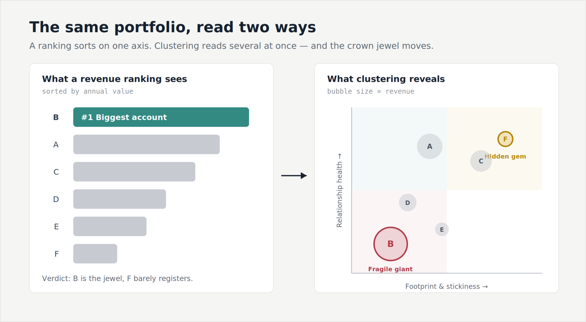
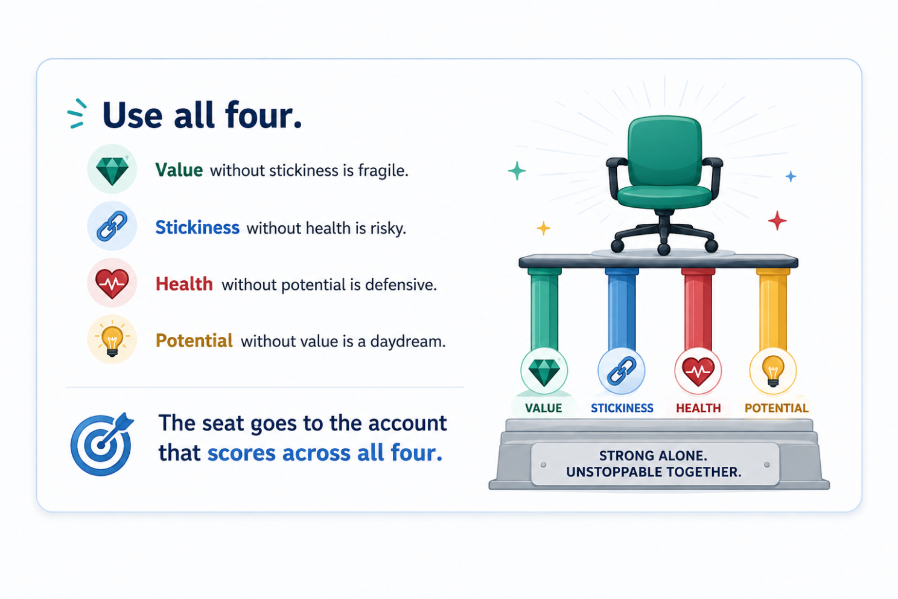

Traditionally, Enterprises grouped their customers by the proportion of revenue generated — quarter on quarter, year on year. Categories are typically defined as Silver, Gold, Diamond, Platinum, depending on the revenue contribution to the Enterprise. The naming convention may vary but the concept remains the same. But that lens has a blind spot.

Rank on revenue alone and the largest accounts look like your greatest assets. But are these accounts the safest? A big account that runs through a single service line, leans on one champion, and has escalations creeping up is not exactly an asset — it's a huge renewal risk. This pattern may not be visible when we rank the customers. This article tries to explore an alternate way of creating these clusters.

## So, How Do We Transition From Left to Right?

Start from the decision, not the data. Before a single variable goes into a model, an Enterprise must be clear on the decision they are making on each account. A portfolio can belong to one of these four — grow it, defend it, optimize the cost of serving it, or harvest and move on. A variable earns its place only if it helps separate accounts into any of these four moves. If a data point wouldn't change which of the four you'd choose, it's noise — leave it out. This one rule is what keeps clustering from becoming a beautiful chart nobody acts on.

## The Variables Are the Whole Game

In practice, the choice of variables is the analysis. The method just groups whatever you hand it; the intelligence sits in deciding what's worth handing over. I think in four families, each answering a different question about an account.

**Value** — what is this account worth to us? We need to resist the urge to just look at the revenue and stop. Check for the margin alongside revenues, because a large low-margin account is not a large account — it's a busy one. And a mid-sized account growing 30% a year is telling you something a flat giant isn't. Deciding parameters: Annual contract value, margin, year-on-year growth, quarterly revenue trend, etc.

**Footprint and stickiness** — how difficult would it be for us to be replaced? An account spread across five service lines with relationships in four functions is well diversified. An account of the same size running through one service line and one friendly VP is standing on a single leg — which can break at any point in time. Deciding parameters: active stakeholders, tenure, share of wallet, etc.

**Health and risk** — is this relationship trending up or down? These are your leading indicators of churn. Deciding parameters: CSAT/NPS, SLA breaches, escalation trend, renewal proximity, DSO (Days Sales Outstanding).

**Potential** — where could this account go next? This is the only forward-looking family, and it does one specific job: it separates an account you should grow from one you should merely defend. Two accounts can look identical today and deserve opposite strategies because one has room to run and the other doesn't. Deciding parameters: whitespaces, references/testimonials, open pipeline value.

A few ground rules. Leave out any number that won't change a decision. Don't pile in several versions of "size," or the groups just rebuild your revenue tiers. And put everything on the same scale first — revenue in crores/million USD, CSAT out of 5 — otherwise the big numbers drown out the rest, and you're back to ranking by revenue.

## So, How Do We Know the Grouping Is Right?

I was exploring k-means, an unsupervised machine learning method often used to create distinct customer segments. There's a simple, tried and tested check for this — the silhouette score. In simple terms, it asks two things of every customer in a group: how close are they to the others in their own group (is there a natural fit, or an outlier sitting at the edge?), and how close are they to the nearest other group (have they been wrongly segmented into this cluster?).

When I combine this, each customer gets a score between -1 and +1. A score closer to +1 indicates that they sit comfortably inside their own group. If the score is around 0, they're on the fence between two groups and could go either way. Below 0, there is a high probability that they are in the wrong group. Average that across everyone and you get a single number for the whole segmentation: a quick read on whether the groups are tight and well separated, or overlapping.

A single number is easy to misuse. So a few things decide whether the silhouette is telling you the truth. Scale your inputs first — the score is built on distance, so if revenue is in crores/USD millions and CSAT is measured on a scale of 1 to 5, the big numbers dominate and we end up scoring revenue.

Use the same yardstick we clustered with — distance can be measured in different ways (e.g., Euclidean, Chebyshev), and the silhouette has to use the one we actually built the groups with. Don't just chase the most groups — the score can help us decide how many groups to make. Look group by group, not just the average — one healthy overall score can hide a single overlapping group. To avoid this, check each group's own score, and watch the customers scoring below zero, because they're the ones sitting in the wrong bucket.

This exercise is an indicator that we earned the right to trust our groups. But it says nothing about whether they are useful.

## Introducing the Archetype Framework — TIER

This is the stage where we try to transform our statistical analysis into something we can act on. There's no fixed rule for how many archetypes to use; TIER is one framework that works well.

**Trusted** — high value, broad footprint, healthy. Your reference customers and your margin base. The job is to defend and deepen: protect the relationship, protect the price, keep them reference-able.

**Incubating** — modest revenue, but high stickiness, high satisfaction, real whitespace. The hidden gems, easy to overlook precisely because they're small. Your best return on farming effort usually sits here, not in the giants. The job is to grow.

**Exposed** — high revenue, narrow footprint, one champion, softening health. This can be a fragile giant. The job is to de-risk before renewal: widen the stakeholder base, explore/expand another service line.

**Retiring** — low margin, high effort, escalation-heavy. These accounts drain your energy and resources. An ideal strategy is to optimize or rationalize: renegotiate the scope, fix the delivery model, or plan a graceful exit.

A ranking sorts your customers by what they bill. Clustering groups them by what they are — and occasionally warns you that the account you were proudest of is the one to worry about first.

The technique is ordinary. The discipline — start from the decision, choose variables that serve it, and act on the tier rather than the rank — is where the magic lives.

The good news: most of the data already sits in your systems. You need one row per account, with columns drawn from the four families — the concrete version of everything above.

A couple of caveats before I close: the scores and groups in this piece are illustrative — a worked example to show the shape of the method, not output from a live dataset. And clustering only surfaces the groups; it won't hand you a strategy. The judgement — what each tier deserves — is still yours.
